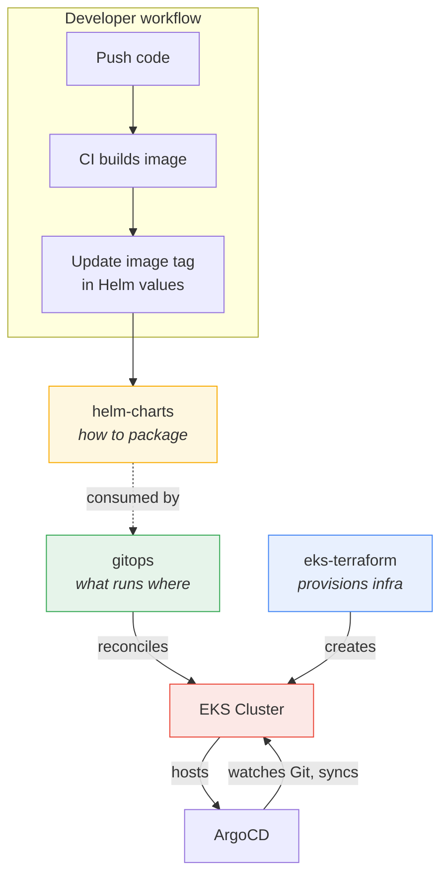
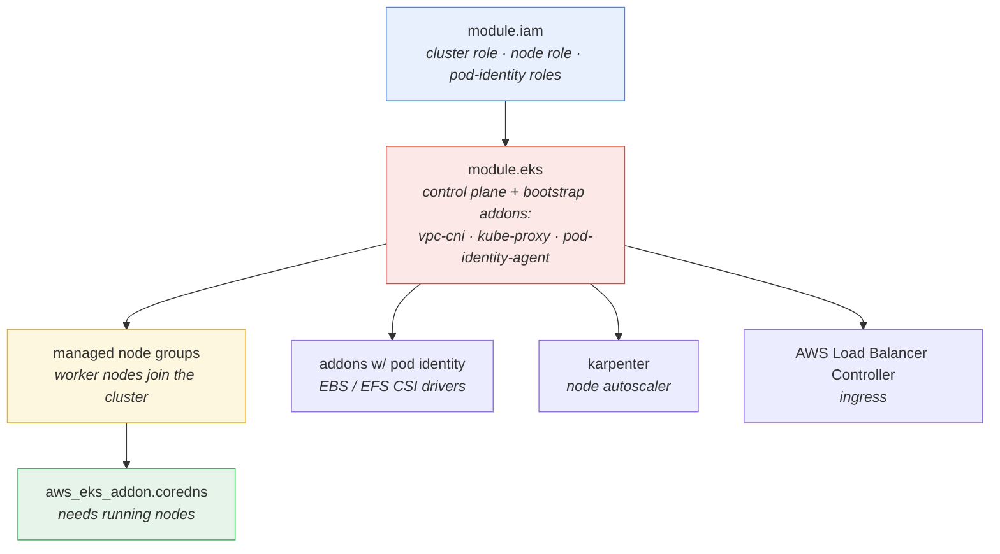
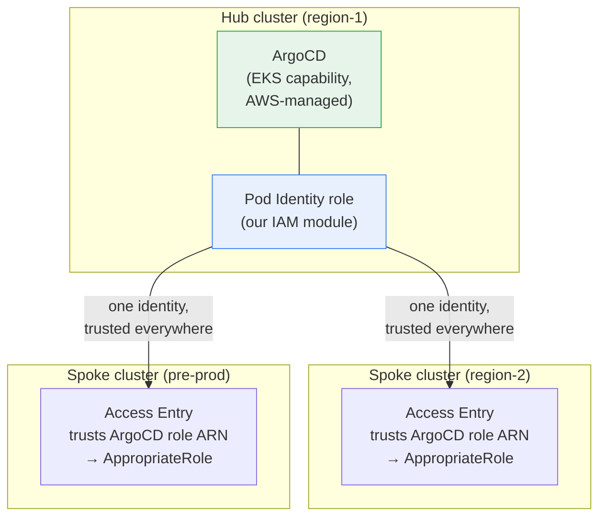
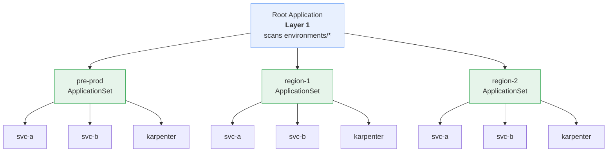
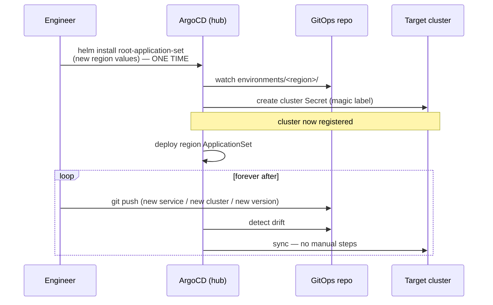
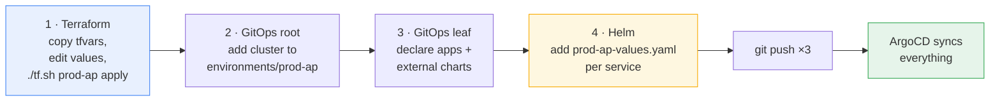

# A Platform Engineering Blueprint for Multi-Cluster Kubernetes on Amazon EKS

*How to turn "stand up a new production region" from a multi-week infrastructure project into a directory of config files and a `git push` — and the engineering decisions that make it possible.*

> **When we say "low effort"**, we mean it relative to the alternative: clicking through 47 AWS Console screens, second-guessing which VPC you're in, and praying you didn't accidentally provision a `p4d.24xlarge` in the wrong region. With this architecture, "adding a region" means editing a few YAML and HCL files and running a script. Your wrists will thank you, and so will your AWS bill.

---

## Where This Starts

If you've run workloads on a managed compute platform — Elastic Beanstalk, App Runner, ECS-with-a-console-click — across more than one region, you know the shape of the problem. It works, right up until it doesn't *scale as an operational model*. The platform grows, and you start wanting control you didn't need on day one: control over how infrastructure is provisioned, how applications are packaged, how nodes scale, how a workload gets exactly the cloud permissions it needs and nothing more.

This is the wall almost every organization hits once it operates in more than one region. The existing setup works. But every new region is a small project. Every new service is a slightly different snowflake. Pre-production resembles production the way a sketch resembles a photograph — close enough to be reassuring, different enough to burn you on a Friday deploy.

The trigger is rarely a single outage. It's the slow realization that the *process* doesn't compose. Onboarding an application, provisioning a cluster, standing up a disaster-recovery region, and expanding into a new geography end up as four different runbooks when they should be one. And the gap between staging and production is exactly the kind of gap that hides bugs until they reach customers.

So before writing a line of Terraform, I find it's worth writing down the questions you actually need to answer:

- How do you make onboarding a new application almost effortless?
- How do you make standing up a new production or DR region a *repeatable process* instead of an infrastructure project?
- How do you achieve real production parity — pre-prod that mirrors prod closely enough that "it worked in staging" means something?
- How do you eliminate duplicated infrastructure code, and the configuration drift that always follows it?
- How do you keep the operational model *constant* as clusters, regions, and services multiply?

The honest answer to all five is the same: **you don't solve them one at a time.** Point solutions accumulate into the exact snowflake problem you were trying to escape. Instead, you pick a small set of architectural principles and let every decision fall out of them.

The five I keep coming back to:

- **Declarative** — Git is the single source of truth. If it isn't in a repo, it doesn't exist.
- **Controlled** — every layer is explicitly managed. We deliberately chose *not* to hide behind an opinionated platform abstraction, because the abstraction is exactly what fails you in the long tail.
- **Modular** — infrastructure, platform components, and applications are independent building blocks that evolve on their own clocks.
- **Parameterized** — one codebase per layer powers every cluster, region, and environment. Configuration carries the differences, code does not. (Assuming your YAML indentation is strictly two spaces, because Kubernetes is famously allergic to tabs.)
- **Consistent** — the same patterns and the same workflow, everywhere, with no exceptions worth memorizing.

Everything below is a consequence of those five lines.

> **A note on scope.** This framework is about the Kubernetes infrastructure and its GitOps deployment model. Stateful dependencies (databases, Redis) and per-region application secrets are deliberately treated as separate concerns — *attached resources* the workloads reach over the network, swapped per environment by config rather than wired into the platform (**12-Factor IV, Backing services**). That's not a gap — it's the point. Because the foundation is modular, adding RDS or ElastiCache is a matter of dropping the relevant Terraform module into the same codebase; it doesn't change the platform's shape.

This article walks through the architecture that resulted, built on Terraform, Helm, ArgoCD, and a two-layer GitOps model — and, more importantly, *why* each piece is shaped the way it is.

---

## The Architecture: Three Repositories, One Source of Truth

The platform splits across three repositories, each owning exactly one question:

| Repository | Answers the question | Tool |
|:---|:---|:---|
| **`eks-terraform`** | *What does the infrastructure look like?* (clusters, IAM, networking) | Terraform |
| **`helm-charts`** | *How is each application packaged?* | Helm |
| **`gitops`** | *What runs where?* | ArgoCD |



**Why three repositories instead of one monorepo?** A monorepo would have been simpler to *clone*. But the three concerns have genuinely different change cadences, blast radii, and owners. Infrastructure changes are rare, dangerous, and reviewed by a small group. Application packaging changes constantly and is owned by service teams. Deployment intent changes whenever anything ships. Coupling them in one repo means a frontend engineer's values tweak shares a history — and a CI pipeline — with cluster IAM.

> **What we gained:** clear ownership boundaries, independent versioning, and a blast radius that stops at a repository edge.
> **What we sacrificed:** atomic cross-cutting changes. A change that spans all three layers now spans three PRs, and you have to think about ordering. We decided that discipline was a feature, not a tax — but it *is* a tax, and you should know you're paying it.

The rest of this article is three repositories deep. We'll go bottom-up: the ground the platform stands on, then how applications are packaged, then how deployment actually happens.

---

## Layer 1: Infrastructure as Code with Terraform

### One Codebase, Many Environments

**The problem.** The default Terraform layout for multiple environments is a directory per environment: `terraform/prod/`, `terraform/staging/`, `terraform/dev/`. It feels organized. It is a trap. The moment those directories exist, they begin to drift — someone fixes a bug in `prod/` and forgets `staging/`, an instance type gets bumped in one place and not another, and six months later "staging mirrors production" is a polite fiction.

**The constraint.** You need dozens of clusters across regions and environments to be *provably* identical in structure, with only intentional differences between them.

**The decision.** One set of Terraform modules. Zero per-environment code. Every difference between clusters lives in `.tfvars` files; the code that consumes them never changes. This is **12-Factor I (Codebase)** applied to infrastructure — one codebase, many deploys — and it sets up two factors that follow from it for free: **III (Config)**, since every per-environment value is config rather than code, and **X (Dev/prod parity)**, since pre-prod runs the *same* code as prod with only its values swapped.

```
eks-terraform/
├── main.tf                  # The single root module — same for every cluster
├── variables.tf
├── modules/
│   └── iam/                 # Centralized IAM: cluster role, node role, pod-identity roles
│       └── pod_policies/    # Per-service least-privilege policy JSON, organized by env
├── backends/                # One backend config (S3 + lock) per cluster → state isolation
├── tfvars/                  # The only thing that changes between environments
│   ├── app-clusters/
│   │   └── <env>/           # common, eks-cluster, node-groups, addons, pod-identity
│   └── use-case-clusters/   # Clusters for a separate use case (control plane, POCs, internal tools), same shape
└── tf.sh                    # Wrapper that wires the right backend + tfvars together
```

**The implementation.** Every environment is a directory of `.tfvars` files. The split — `common`, `eks-cluster`, `node-groups`, `addons`, `pod-identity` — isn't cosmetic; it lets you reason about one facet of a cluster (say, its node groups) without scrolling past everything else. The Terraform itself is environment-agnostic by construction. The cluster configuration also declares which control-plane log types to emit — api, audit, authenticator, controller-manager, scheduler — as event streams to CloudWatch/Other Observability tools using collector like otel collector agent, never as files on a node to be rotated by hand (**12-Factor XI, Logs**: treat logs as event streams, and let the platform handle collection).

> **What we gained:** drift becomes structurally impossible. Two clusters can only differ where a value differs, and every value is in Git, in a diff, in a PR.
> **What we sacrificed:** the `.tfvars` files themselves can drift if you copy-paste carelessly when creating a new environment. The code can't drift, but the *config* can. We mitigate this with the wrapper script and convention, not with enforcement — a known soft edge we'll come back to in the limitations section.

The wrapper script exists for one reason: multi-environment Terraform has a ceremony problem. Every command needs the right backend config *and* the right set of variable files, and getting that pairing wrong is how you apply staging's config against prod's state. So we hid the ceremony:

```bash
./tf.sh region-2 plan     # discovers backends/app-backends/region-2.hcl
./tf.sh region-2 apply    # + every tfvars/app-clusters/region-2/*.tfvars, in order
```

**The lesson:** the goal of a single codebase isn't to write less Terraform. It's to make "are these two environments the same?" a question you answer by reading a diff, not by trusting your memory.

### Dependency Ordering: The Lesson That CoreDNS Taught Us

The single hardest thing about provisioning EKS isn't writing the resources. It's *ordering* them.

You learn this the way everyone learns it. Let the EKS module install CoreDNS inline, alongside the cluster, because that's the obvious thing to do and the documentation makes it look free. During provisioning, Terraform will simply *hang*. No error, no progress — just a cluster sitting there while CoreDNS pods wait for somewhere to run.

The cause is embarrassingly simple in hindsight: CoreDNS is a workload, workloads need nodes, and at that point in the apply there are no nodes. The pods sit in `Pending`, the addon never reports healthy, and Terraform waits longer than a bad Zoom connection.

The fix is to stop treating CoreDNS as part of the cluster and start treating it as something that depends on the cluster *having a data plane*. Pull it out into a standalone resource with an explicit dependency on the node groups:

```hcl
resource "aws_eks_addon" "coredns" {
  cluster_name  = module.eks.cluster_name
  addon_name    = "coredns"
  # Karpenter taints its controller nodes; let CoreDNS tolerate them
  configuration_values = var.karpenter_enabled ? jsonencode({
    tolerations = [{ key = "karpenter.sh/controller", value = "true", effect = "NoSchedule" }]
  }) : null

  depends_on = [module.eks_managed_node_group]   # the whole point
}
```

That one `depends_on` is the distillation of the entire ordering problem. Generalized, the dependency graph we settled on looks like this:



Notice IAM sits at the root, isolated in its own module. EKS needs a cluster role before it can exist; node groups need a node role; pod-identity associations need their own roles. Centralizing all of it in `modules/iam` does two things: it breaks the circular dependencies that otherwise appear when the cluster and its roles try to create each other, and it keeps the root module readable. Bootstrap addons that have *no* scheduling requirement (the CNI, kube-proxy, the pod-identity agent) ride along with the control plane; anything that needs to actually run a pod waits for nodes.

Every one of those dependencies is *declared and pinned* — explicit provider constraints, a pinned EKS module version, and exact addon versions (`vpc-cni`, `kube-proxy`, `coredns` all carry an `eksbuild` tag rather than "latest").

> **What we gained:** provisioning that completes on the first try, every time, because the graph encodes what we used to keep in our heads.
> **What we sacrificed:** a slightly more verbose root module — a handful of standalone addon resources instead of one tidy inline block. Worth it.

**The lesson:** the lesson was never "CoreDNS should be installed separately." It's that **dependency ordering is part of your infrastructure definition, not an implementation detail.** The resources are the easy part. The edges between them are where production lives.

### Managing Many Clusters from One ArgoCD

Provisioning a cluster is one thing. Deciding *who deploys to it* is another — and it's the decision that determines whether your platform scales to ten clusters or collapses under ten copies of ArgoCD.

**The problem.** Run ArgoCD inside every cluster and you now operate N ArgoCD installations: N upgrades, N sets of credentials, N dashboards, N things to restart at 3 AM. Run one ArgoCD and you need a way for it to reach clusters it doesn't live in.

**The decision.** A hub-and-spoke model. One cluster in each region hosts ArgoCD; it manages itself and every other cluster in that region. **ArgoCD capability in EKS** — a relatively new feature where ArgoCD runs as an AWS-managed component rather than self-hosted pods we have to babysit. The trust between hub and spokes is pure IAM. 

Say a region has two clusters: a **use-case cluster** — a general-purpose cluster for a separate concern like the control plane, POCs, or internal tooling — and an **app cluster** where the actual services run. You enable the ArgoCD capability on the use-case cluster, give it a Pod Identity role, and grant that role access to the app cluster. If you run only one cluster per region, that's fine too — just enable the ArgoCD capability on it and you're done.

The elegant part is the split between *who is allowed* and *what is intended*, and it falls exactly along the repository boundary:



**Part 1 — Permissions (Terraform).** We enable the capability on the hub cluster. The ArgoCD workloads run in an AWS-managed environment, but the IAM role is *ours*, created by our IAM module and bound via EKS Pod Identity. That role is ArgoCD's AWS-level identity. To let it manage a remote cluster, the remote cluster simply adds an **EKS Access Entry** trusting that role's ARN:

```hcl
# In the remote (spoke) cluster's tfvars
access_entries = {
  argocd_cross_cluster = {
    principal_arn = "arn:aws:iam::123456789012:role/my-argocd-cluster-role"
    policy_associations = {
      cluster_admin = {
        policy_arn   = "arn:aws:eks::aws:cluster-access-policy/AppropriateClusterRole"
        access_scope = { type = "cluster" }
      }
    }
  }
}
```

One IAM role, trusted across clusters. (It's a VIP all-access badge — one identity, every venue, and nobody gets stopped by the IAM bouncer.)

**Part 2 — Intent (GitOps).** Permissions don't tell ArgoCD *which* clusters to manage; that's configuration, and it lives in the GitOps repo. We'll see the exact mechanism in Layer 3 — for now the important thing is the seam: **Terraform grants the trust, Git declares the intent.** Two repositories, zero ambiguity about which one is lying when something breaks.

> **What we gained:** one control plane to operate, AWS-managed so we don't carry the upgrade burden, with trust expressed as auditable IAM rather than copied kubeconfigs.
> **What we sacrificed:** a single management plane is a single thing that can be wrong. We accept a larger logical blast radius on the hub in exchange for not operating N ArgoCDs — and lean on the AWS-managed nature of the capability to shrink the *operational* blast radius back down.

> **Ordering caveat:** if you run multiple clusters in one region and centralize ArgoCD on one of them, provision the hub first. The spokes reference the hub's IAM role ARN in their access entries at creation time.

**The lesson:** cross-cluster management is two problems wearing one trench coat — *trust* and *intent*. Solve them in different repositories on purpose, and "why can't ArgoCD see this cluster?" always has a clear place to look.

### Pod Identity: Least Privilege Without the IRSA Tax

**The problem.** The path of least resistance on EKS is to attach permissions to the node role. Every pod on that node inherits them. That means your frontend can do whatever your batch job can do, and a single compromised pod has the union of everything's permissions. (Giving a frontend pod `AdministratorAccess` is how you end up on the front page of Hacker News for all the wrong reasons.)

**The decision.** **EKS Pod Identity** — the successor to IRSA — gives each workload its own IAM role, scoped to exactly what it needs. No shared node role, no OIDC-provider wiring, no IRSA annotations to keep in sync.

The pattern is four moving parts, and a new service touches only the first two:

1. Write a least-privilege policy as JSON, organized by environment:

```json
// modules/iam/pod_policies/prod/api_server_policy.json
{
  "Version": "2012-10-17",
  "Statement": [{
    "Effect": "Allow",
    "Action": ["s3:GetObject", "s3:PutObject"],
    "Resource": "arn:aws:s3:::my-prod-bucket/*"
  }]
}
```

2. Point a role at it in `pod-identity.tfvars`:

```hcl
pod_identity_roles = {
  "api-server" = {
    policy_file     = "prod/api_server_policy.json"
    namespace       = "production"
    service_account = "api-server"
  }
}
```

3. The IAM module builds the role with a `pods.eks.amazonaws.com` trust policy and attaches the inline policy.
4. Terraform creates an `aws_eks_pod_identity_association` binding the role to the service account — and the pod gets temporary, rotated AWS credentials automatically. No keys, no secrets in the manifest.

The `pod_policies/` directory is organized per environment (`common/`, `pre-prod/`, `prod/`, `region-2/`). Policies in `common/` are genuinely shared (the ALB controller, ArgoCD); everything else is scoped to a region's actual resource ARNs. Adding a region means adding a subdirectory whose policies reference *that region's* resources — which is also what stops a pre-prod role from ever touching a prod bucket.

> **What we gained:** the blast radius of a compromised pod is its own policy, full stop. Permissions are reviewable JSON in Git, diffable per release.
> **What we sacrificed:** policy sprawl. One JSON file per service per environment is a lot of small files, and "least privilege" is only as good as the discipline writing those files. A lazy `"Action": ["s3:*"]` looks identical in the diff to a careful one.

**The lesson:** least privilege isn't a feature you turn on; it's a structure you commit to. Pod Identity gives you the mechanism — the per-service, per-environment file layout is what makes the mechanism *survive* contact with a growing team.

### Karpenter: The Autoscaler That Can't Be Its Own Victim

**The problem.** Cluster Autoscaler reacts slowly and thinks in terms of node groups — it scales a pre-defined ASG up or down. For bursty, heterogeneous workloads that's both slow and wasteful. **Karpenter** talks to the EC2 Fleet API directly and provisions a right-sized node in seconds. (You could say it really *nails* the autoscaling problem.)

But it introduces a wonderfully circular failure mode. Karpenter's job is to add capacity when pods can't schedule. If Karpenter's *own* controller can't schedule because the cluster is full, it can't add the capacity that would let it schedule. The autoscaler needs an autoscaler.

**The decision.** Karpenter's controller runs on a small, dedicated, on-demand node group that nothing else is allowed to touch — guaranteed by a taint, targeted by a label:

```hcl
"karpenter-controller-group" = {
  instance_types = ["t3a.medium"]
  capacity_type  = "ON_DEMAND"          # never spot — the controller must always be up
  scaling_config = { min_size = 1, max_size = 2, desired_size = 1 }
  labels = { "karpenter.sh/controller" = "true" }
  taints = {
    karpenter = { key = "karpenter.sh/controller", value = "true", effect = "NO_SCHEDULE" }
  }
}
```

This is also why the CoreDNS resource earlier carries a matching toleration: critical system pods need to be *allowed* onto these reserved nodes, while ordinary workloads are kept off. The Terraform here provisions only the AWS-side scaffolding (IAM, the interruption queue, subnet discovery tags). The actual `NodePool` and `EC2NodeClass` CRDs — the part that says *what kinds of nodes Karpenter may create* — are managed as a Helm chart deployed through ArgoCD, keeping that lifecycle in GitOps where it belongs.

Karpenter only works because the layer above it embraces **12-Factor IX (Disposability)**. Its consolidation logic constantly terminates underutilized nodes and reschedules their pods onto cheaper ones — which is only safe if a node dying is a non-event. Nodes are immutable cattle (replaced, never patched in place), and pods start fast and shut down gracefully, so Karpenter can churn the fleet under you without anyone noticing. Disposability isn't a nice-to-have here; it's the precondition that makes aggressive autoscaling tolerable.

> **What we gained:** seconds-not-minutes scaling, right-sized instances, and a controller that can't starve itself.
> **What we sacrificed:** a permanently-running on-demand node group that mostly sits idle. We pay for a small always-on island so the autoscaler is never homeless. Cheap insurance.

**The lesson:** any system that manages a resource it also consumes needs a reserved island it can always stand on. (Explaining that the autoscaler couldn't autoscale because the autoscaler needed an autoscaler is a conversation you want to have exactly zero times.)

---

## Layer 2: Application Packaging with Helm

Provisioning clusters solved where workloads *run*. It said nothing about how hundreds of services get packaged consistently enough that a deployment looks the same whether it's the first service or the four-hundredth. That's Helm's job.

**The problem.** Every microservice needs the same furniture — a deployment, a service, maybe an ingress, an HPA, a service account — plus its own specific bits. Hand-write that per service and you get hundreds of subtly different manifests. Environment-specific values (DB URLs, replica counts, feature flags) baked into templates guarantees drift.

**The decision.** Every service is an independent Helm chart, and *all* environment-specific configuration is pulled out into per-environment values files. That extraction is **12-Factor III (Config)** at the application layer: the same chart that runs one replica with `LOG_LEVEL=DEBUG` in pre-prod runs fifteen autoscaled replicas with `LOG_LEVEL=WARNING` in production, with no template change — only values.

```
helm-charts/
├── service-a/
│   ├── Chart.yaml
│   ├── templates/          # deployment-web, deployment-worker, service,
│   │                       # ingress, hpa, serviceaccount, scaledjob, ...
│   └── envs/               # ← the only thing that differs per environment
│       ├── pre-prod-values.yaml
│       ├── region-2-values.yaml
│       └── region-1-values.yaml
├── service-b/ ...
└── karpenter-config/       # Karpenter CRDs packaged as a chart, same convention
```

(Ah, Helm — the tool that lets you write YAML inside Go templates so you can generate more YAML. Yo dawg, we heard you like templating. It is, for all the memes, still the most pragmatic way to package a service for GitOps.)

**The convention that does the heavy lifting:** `<service-name>/envs/<env>-values.yaml`. This naming is not decoration — it's the contract between Helm and ArgoCD. As we'll see in Layer 3, ArgoCD's Git Generator globs for files matching `service-*/envs/region-2-values.yaml` and turns each match into a running Application. Onboarding a service to a region is, quite literally, creating a file with the right name. Convention over configuration, doing actual work.

**A reality check on what a "service chart" really contains.** A tutorial chart has one deployment and one service. A production chart is a small zoo, and pretending otherwise sets you up for surprise. The charts here routinely carry:

- web deployments *and* a fleet of worker deployments (queue consumers, processors)
- HPAs for CPU-bound scaling **and** KEDA `ScaledJob`s for event-driven scaling off a queue depth — because not everything scales on CPU
- pre-install/pre-upgrade migration hooks, so database migrations run *before* new pods take traffic
- PodDisruptionBudgets, so a node drain during maintenance doesn't take a service to zero
- scoped RBAC (Roles, not ClusterRoles) so a workload gets only the in-cluster permissions it needs

None of this is exotic. All of it is the difference between a chart that demos and a chart that runs payroll. It also quietly satisfies four more factors at once. The web and worker deployments are stateless — state lives in the attached backing services, never on the pod (**12-Factor VI, Processes**), which is precisely what lets you add replicas without coordination. Each service exports itself over its own container port via a Kubernetes Service — self-contained, no externally injected web server required (**12-Factor VII, Port binding**). Scaling *is* adding processes: more web replicas via the HPA, more workers via KEDA reacting to queue depth (**12-Factor VIII, Concurrency** — scale out via the process model, not by making one process bigger). And the migration hooks, `ScaledJob`s, and CronJobs are one-off administrative processes shipped in the *same* image as the long-running ones, run against the *same* config (**12-Factor XII, Admin processes**) — so a migration can never run against a different build of the code than the pods it's migrating for.

**Why not one umbrella chart with subcharts?** you can  consider it, I reject it for one concrete reason: **we wanted an independent sync per service.** Under an umbrella chart, every service is a subchart of a single release, which means a single ArgoCD Application. One Application means one sync, one health status, one rollback unit — touch the shared values and *every* service redeploys, and a single bad subchart can wedge the whole release. By giving each service its own chart, each becomes its own ArgoCD Application: it syncs on its own, reports health on its own, and rolls back on its own. A change to `service-a` never moves `service-b`, and one bad commit can't take the platform down with it. (Umbrella charts are like group projects in college: one person's bad commit, everyone's grade.)

> **What we gained:** independent deploy/rollback per service, and a single naming convention that makes ArgoCD discover services with zero wiring.
> **What we sacrificed:** template duplication. Each chart carries its own `_helpers.tpl` and its own copy of boilerplate. A shared library chart would DRY that up — at the cost of coupling every service to a shared template version, which is the exact coupling we left the umbrella to avoid. We chose duplication over coupling. It's a real tradeoff, not a free win.

**The lesson:** the value of a packaging convention isn't the template — it's that the *name of a file* becomes an executable instruction. Get the convention right and the layer above it gets to be dumb, which is the highest compliment you can pay a layer.

---

## Layer 3: GitOps with ArgoCD — The Two-Layer ApplicationSet

This is where it all converges. The GitOps repo is the single source of truth for what runs where. (If Terraform is the skeleton and Helm is the muscle, this is the nervous system — and the part most likely to give you a headache.) It's also where **12-Factor V (Build, release, run)** stops being a slogan and becomes mechanically enforced: CI *builds* an immutable image, bumping an image tag in a values file *is* the release, and ArgoCD *runs* it. The three stages can't bleed into each other because they live in different systems — you physically cannot "just SSH in and patch it," because the next reconcile would revert you.

**The problem.** With one ArgoCD managing many clusters, you need to answer two different questions declaratively: *which clusters exist and should be managed*, and *what should run on each of them*. Cram both into one layer and adding a cluster, adding a service, and registering a new region all become the same tangled edit.

**The decision.** Separate them into two layers. A **Root Application** answers "which clusters" and "which app-sets." Per-environment **ApplicationSets** answer "which workloads." It's the App-of-Apps pattern, deliberately split at the seam between cluster management and workload management.



**Layer 1 — the Root Application** scans `root-application-set/environments/`. For each environment it does two things: it **registers the cluster** with ArgoCD, and it **deploys that environment's ApplicationSet**.

**Layer 2 — the ApplicationSets** generate the actual workload Applications, using two complementary generators:

- a **Git Generator** that globs the helm-charts repo for internal services, and
- a **List / multi-source pattern** that deploys external charts (Karpenter, KEDA) from upstream registries with our values.

### Cluster Registration: Plant One Seed by Hand

Here's the cross-cluster *intent* we promised back in Layer 1. ArgoCD registers a cluster when it sees a Kubernetes Secret carrying the label `argocd.argoproj.io/secret-type: cluster`. So rather than running `argocd cluster add` by hand, the Root Application *templates those secrets out of Git*:

```yaml
# root-application-set/templates/secrets.yaml
{{- range .Values.clusters }}
---
apiVersion: v1
kind: Secret
metadata:
  name: {{ .destinationName }}
  namespace: argocd
  labels:
    argocd.argoproj.io/secret-type: cluster   # the magic label ArgoCD watches
stringData:
  name:    {{ .destinationName }}
  server:  {{ .server }}
  project: {{ .project }}
{{- end }}
```

For an *existing* region, adding a cluster is fully automatic: add an entry to that region's `values.yaml`, push, and ArgoCD registers it. (No `argocd login`, no kubeconfig juggling across five clusters every time credentials rotate. Not us.)

Standing up an *entirely new region* needs exactly one manual step — a one-time `helm install` of the `root-application-set` chart against the hub, pointed at the new region's values. ArgoCD has to be told about the new region *once* before it can start watching it. After that, GitOps takes over completely:



(It's the infrastructure equivalent of planting one seed by hand so you can harvest the whole field automatically — or, more honestly, installing the robot that builds the robots.)

### The Git Generator: Services Discover Themselves

The internal-services ApplicationSet is where the Helm naming convention pays off:

```yaml
generators:
  - git:
      repoURL: https://github.com/your-org/helm-charts.git
      revision: main
      files:
        - path: service-*/envs/region-2-values.yaml
```

That glob matches every service with a `region-2-values.yaml`, and each match becomes an Application. **Onboarding a service to a region is creating one file.** There is no central list to edit, no ApplicationSet to touch — the directory structure *is* the manifest of what runs there.

### External Charts: The Multi-Source Pattern

Third-party charts (Karpenter, KEDA) live in upstream registries, but their configuration is ours and varies per environment. ArgoCD's **multi-source** feature lets us pull the chart from one place and the values from another:

```yaml
sources:
  - repoURL: oci://public.ecr.aws/karpenter/karpenter
    chart: karpenter
    targetRevision: "1.8.1"
    helm:
      releaseName: karpenter
      valueFiles:
        - $values/charts/karpenter/envs/region-1/values.yaml
  - repoURL: https://github.com/your-org/gitops.git
    targetRevision: main
    ref: values        # ← resolves the $values reference above
```

For charts that need only a few knobs, inline `valuesObject` keeps it simple — no second source required. (And yes, use Sealed Secrets or External Secrets Operator for secrets in Git: base64 is an *encoding*, not encryption. We're looking at you, junior devs.)

### Sync Policy Is an Architectural Decision, Not a Default

Here's a subtlety that's easy to miss and expensive to get wrong: **the two layers run different sync policies on purpose.**

The **root layer** — cluster registration and ApplicationSet deployment — runs aggressively: `prune: true`, `selfHeal: true`. If a cluster registration Secret gets deleted or drifts, we *want* ArgoCD to slam it back into place immediately. This is platform plumbing; there is no legitimate reason for it to be out of sync with Git, ever.

The **leaf/workload layer** is where you should think harder. Aggressive `prune` on stateful workloads can delete a PVC because someone restructured a chart. Aggressive `selfHeal` can fight an operator that legitimately mutates its own resources. Many teams run the workload layer more conservatively — manual or gated sync, prune off — precisely because workloads carry state and surprises in a way that platform plumbing doesn't.

> **What we gained:** drift is impossible where it's never legitimate (the platform layer), and recoverable-by-human where automation could do damage (the workload layer).
> **What we sacrificed:** uniformity. "Everything self-heals" is a simpler sentence to say than "the platform self-heals and workloads are gated." We traded a clean slogan for a policy that matches how much each layer can hurt you.

**The lesson:** `selfHeal: true` is not a setting you flip globally. It's a statement about how much you trust automation to act without a human, and that trust should be *higher* for plumbing than for the things holding customer data.

---

## Putting It Together: Onboarding a New Region

Theory is cheap. Here's the whole machine running. Say compliance needs an **Asia-Pacific** production region, `prod-ap`. End to end:



**Step 1 — Provision (Terraform).** Copy an existing environment's tfvars, change the cluster name, region, and subnets, drop in a backend config, and apply:

```bash
cp tfvars/app-clusters/region-2/*.tfvars tfvars/app-clusters/prod-ap/
vim tfvars/app-clusters/prod-ap/*.tfvars        # cluster name, region, subnets
echo 'bucket = "my-terraform-state"
key    = "eks/prod-ap/terraform.tfstate"
region = "ap-southeast-1"' > backends/app-backends/prod-ap.hcl
./tf.sh prod-ap apply
# (Now grab a coffee. EKS creation still takes time — we automated the config,
#  we didn't invent time travel.)
```

**Step 2 — Register the cluster (GitOps root).** Add `environments/prod-ap/values.yaml` with the cluster's endpoint and which ApplicationSet it should run. Because this is a brand-new region, this is the one place you do the single bootstrap `helm install`.

**Step 3 — Declare what runs there (GitOps leaf).** Add `application-sets/environments/prod-ap/values.yaml` listing the service glob and any external charts (Karpenter, etc.) for the region.

**Step 4 — Add per-service values (Helm).** For each service, `cp region-2-values.yaml prod-ap-values.yaml`, fix the region-specific endpoints, done. The Git Generator finds them on the next sync.

**Push all three repos. ArgoCD reconciles everything.** It's an obsessive robot constantly making reality match Git — and if someone goes cowboy and `kubectl edit`s a deployment on a Friday evening, the platform layer's `selfHeal` quietly reverts it. A new production region in a fraction of the time it used to take, with zero manual `kubectl`.

---

## The Principles, Reinforced

The framework leans heavily on the [Twelve-Factor App](https://12factor.net/) methodology — written for application code, but it transfers cleanly to platform engineering. All twelve factors are called out inline in the sections where they earn their keep: **I (Codebase)** and **III (Config)** and **X (Dev/prod parity)** in the single-codebase Terraform design, **II (Dependencies)** in the pinned addon versions, **IV (Backing services)** in the scope note on stateful dependencies, **V (Build, release, run)** in the ArgoCD GitOps layer, **VI (Processes)**, **VII (Port binding)**, **VIII (Concurrency)**, and **XII (Admin processes)** in the Helm chart design, **IX (Disposability)** in Karpenter's node lifecycle, and **XI (Logs)** in the cluster logging configuration.

Everything beyond that is platform-engineering principles those twelve factors enable:

- **GitOps.** If it isn't in Git, it doesn't exist. (We like our infrastructure the way we like our relationships: fully committed.)
- **Separation of concerns.** Terraform owns infrastructure, Helm owns packaging, ArgoCD owns orchestration — and no tool reaches into another's territory.
- **Convention over configuration.** A correctly-named values file is an executable instruction; the Git Generator does the rest.
- **Least privilege.** Pod Identity scopes every workload to its own role. A compromised pod's blast radius is its own policy.
- **Blast-radius isolation.** Per-cluster Terraform state, per-service ArgoCD Applications, per-environment policy files. Nothing shares a fate it doesn't have to.
- **Self-healing, calibrated.** Aggressive at the platform layer, deliberate at the workload layer — because the cost of an automated mistake differs by layer.

---

## What We'd Tell You Before You Build This

No architecture is free, and the honest part of an engineering writeup is the part that lists what still hurts. If you adopt this pattern, walk in with eyes open:

- **The new-region bootstrap is still one manual step.** That first `helm install` per region is unavoidable with this design — ArgoCD has to learn a region exists before it can watch it. It's one command, but it's a command, and it's the one place the "pure GitOps" story has an asterisk.
- **A single management plane is a single point of leverage.** Hub-and-spoke buys operational simplicity and pays for it in concentration. The AWS-managed ArgoCD capability shrinks the operational risk, but the logical blast radius of "something is wrong with the hub" is real. Plan its access and its recovery accordingly.
- **tfvars and policy JSON can drift even when code can't.** The code is provably identical across environments; the *configuration* is only as consistent as the humans copying it. If you grow past a handful of environments, invest in generating or validating these files rather than hand-copying.
- **Independent charts mean duplicated templates.** This pattern chooses duplication over the coupling of a shared library chart. At a couple dozen charts it's fine; at 200 you may want a library chart and the coupling that comes with it. Know which side of that line you're on.
- **Least privilege is a discipline, not a guarantee.** Pod Identity gives every workload its own role; it does nothing to stop a tired engineer from writing `s3:*`. The structure makes the right thing *easy*, not *automatic*. Review the policy diffs.

None of these are reasons not to build it. They're the things I wish someone had said out loud before I did.

---

## The Blueprint

A complete, minimal, **generic** reference implementation accompanies this article in [`multi-cluster-framework/`](https://github.com/sujaldyavanapelli7/multiclusterframeworkrepo). It's a blueprint, not a sanitized production repo — built from first principles to demonstrate the patterns above:

- **Terraform** — full EKS provisioning with the IAM module, the CoreDNS ordering fix, Karpenter, the ArgoCD capability, and multi-environment tfvars.
- **GitOps** — Root ApplicationSet plus leaf ApplicationSets, with both Git and multi-source generators, and the cluster-registration secret template.
- **Helm** — a sample service chart and the Karpenter CRD chart, following the `envs/<env>-values.yaml` convention.

Clone it, rename the placeholders, and it should onboard your first cluster the same way it onboards the hundredth.

---

## Final Thoughts

Building a platform like this is an investment — deliberate design, careful dependency ordering, and a willingness to think in layers instead of scripts. But when regional data residency is a compliance requirement and multi-region expansion is a business reality, ad-hoc-per-region stops being an option.

The return is immediate and it's measured in *boredom*. When the next region needs to go live, the answer is a directory of config files and a `git push`. No war room. No infrastructure sprint. No surprises.

**The best platform makes the right thing the easy thing.** Adding a region should be boring. Adding a service should be a values file. Recovering from drift should be automatic. Design for modularity, build for consistency, and then let the platform do its job.

---

*If you found this useful, I write about DevOps, Platform Engineering, and Kubernetes architecture. Follow for more. All sample configuration referenced here lives in the linked GitHub repository.*
